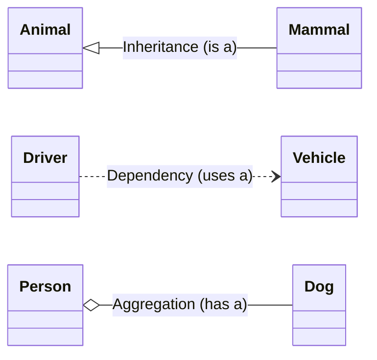
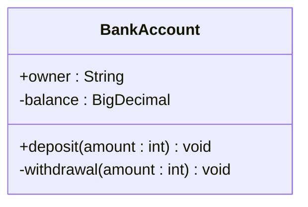

# Option D - Object-Oriented Programming

# UML

# Object-Oriented Programming

## Concepts in Object-Oriented Programming

- **Unified Modeling Language (UML)**: The Unified Modeling Language provides a way to visualize the design of any software system and has evolved into the standard for modeling object-oriented programs.
- **Object-Oriented Programming (OOP)**: Object-Oriented Programming is a programming paradigm that uses abstraction to model entities as objects or events. It employs programming objects that describe data (properties) and behavior (methods) of real-world objects, facilitating code reusability and abstraction.
- **Constructor**: A **method** with **the same name as the class,** **invoked when an object is created to initialize its values**. Constructors are **declared only once**.
- **Accessor**: A **method** used to **retrieve a specific value of an object**, especially when variables are **private**. Accessors typically have method names prefixed with "**get**" and are essential for **granting controlled access to private variables**.
- **Mutator**: A method designed to **modify (private) instance variables** within an object or class. Mutators often have method names prefixed with "**set**" and are responsible for altering the state of an object.
- **Parameter**: Parameter is the name given to the information utilized within a method, function, or procedure. It acts as a placeholder for the data on which the method, function, or procedure operates.
- **Signature**: The signature of a method comprises the method's name, along with its parameters, indicating the number and types of arguments it accepts.
- **Return Value**: The return value is the data or value that a method sends back or returns to the part of the code that invoked the specific method.
- **Class**: A class is an extensible **template** for a particular object, providing initial values for state (member variables) and implementations of behavior (member functions or methods), but **does not occupy any memory** in a program.
- **Object**: An **object** is an **abstract entity** characterized by its **properties** or **attributes** (the data it holds) and the **methods** (actions it can perform).
- **Instantiation**: The process of **creating an object** for that class. This action **allocates memory** to accommodate the object's **data and actions**.
- **Reference**: A reference is a variable whose value indicates the memory location of an object.

## Advantages of Object-Oriented Programming or Modularity

- **Enhanced Efficiency and Speed in Development**: Reusing objects/modules across sub-groups facilitates quicker testing as each module is small and independent.
- **Improved Team Collaboration and Work Division**: Allows work to be split among sub-groups efficiently, supporting team dynamics.
- **Reduced Development Time and Effort**: Due to less new code being required and the ability to re-use objects without needing to re-program.
- **Improved Code Quality and Maintainability**: As the code is shorter and easier to understand, it enhances readability and simplifies maintenance.

## Disadvantages of Object-Oriented Programming or Modularity

- **Not Ideal for Small Projects:** Object-Oriented Programming may not be suitable for minor projects where the inherent complexity of the paradigm offers little benefit in comparison to its implementation effort.
- **Increased Program Size:** Generally, Object-Oriented Programming programs tend to be larger than those written in other paradigms. This increase in size can lead to slower performance, as larger programs require more resources to run efficiently.
- **Greater Effort in Construction:** The process of creating an OOP-based application often requires more effort. This is attributed to the need for decomposition to achieve abstraction, which is a foundational aspect of Object-Oriented Programming but can be time-consuming and complex to implement effectively.

## Properties

### Polymorphism

- **Overload (Static Polymorphism)**
  - **Definition**: Overloading is a form of static polymorphism where a program can have multiple methods with the same name but different signatures.
  - **Mechanism**: The compiler distinguishes overloaded methods at compile time based on method type, parameter type, and parameter name.
- **Override (Dynamic Polymorphism)**
  - **Definition**: Overriding is a form of dynamic polymorphism in which a subclass redefines or rewrites methods inherited from the parent class to suit its specific requirements.
-  **Advantages** of using ***Polymorphism***  
   - Polymorphism allows an external program to use the same method actions on all subclasses;
   - By allowing overridden functions in child classes to add only the code that is needed for the unique processing of that sub-class;

### Encapsulation

- **Modifiers**

| Modifiers | Description                                                  |
| --------- | ------------------------------------------------------------ |
| Private   | Accessible only within the same class.                       |
| Public    | Accessible by any class.                                     |
| Protected | Accessible within the same package.                          |
| Static    | Shared among all instances, belongs to the class;  Can be accessed through either the class name or an object name. |
| Final     | Cannot be modified after declaration.                        |

- **Static Variables**
  - Belong to the class, not to individual objects.
  - Declared once only; not re-declared in each object.
  - Values are shared among all objects of the class.
- **Static Methods**
  - Are class methods, not object methods.
  - Independent of the objects in the class.

- **Features**

  - **Data Protection**: Encapsulation protects data from accidental changes or unauthorized access outside the object. This is achieved by designating variables as private, restricting direct access.
  - **Accessor and Mutator Methods**: Encapsulation necessitates the use of accessor (get) and mutator (set) methods, which control how other classes access and modify the private variables of an object. These methods provide a controlled interface for interacting with the object's data.
  - **Combining Data and Methods**: Encapsulation involves bundling data (variables) and methods (functions) into a single class. This combination promotes a cohesive and organized approach to managing data, making it easier to understand and work with the class.
  - **Code Reusability**: Encapsulation facilitates code reusability by encapsulating data and methods within a class. This means the same class can create multiple instances with different data, reducing the need to duplicate code for similar functionality.
- ***Advantages*** of using ***Encapsulation***  
  - Encapsulation places all ***attributes*** and ***methods*** that relate to a ***particular*** object;
    - For example, `Payment` class includes attributes such as the food and drink arrays and method such as `calculateBill()`;
    - This provides a clearer view of view/understanding of each section of the problem;
    - Which can lead to more efficient programming (faster and less errors).  
  - Encapsulations ***protects*** the values of the data stored within the object;  
    - From ***accidental changes*** made by other classes;  
    - For example, quantity in the `FoorItem` class cannot be altered through another variable called quantity in another class; 
    - This allows programmers to select ***any*** variable names they wish on choice of variable names. 

## Relationships

### **Aggregation (`Has a`)**

- **Advantages**
  - **Code Reuse and Reduced Coding**: Aggregation facilitates code reuse, minimizing the need for repetitive coding. For instance, if the code for a `{className}` object already exists, it can be reused in other related classes.
  - **Better Organization of Objects**: Aggregation promotes better structuring of objects. With aggregation, the attributes and methods of an incorporated object remain encapsulated within its original class, fostering a more organized, modular codebase.
- **Disadvantages**
  - **Increased Dependencies**: Aggregation creates dependencies between classes. A change in one class, such as the `{classNameA}` class, might lead to unexpected consequences and require rewriting in another class, like the `{classNameB}` class. This interdependency requires careful management and testing.
  - **Potential for More Complex Code**: Aggregation can complicate code, particularly when navigating the functionalities of the aggregated objects. This complexity requires an in-depth understanding and precise coding practices to prevent and troubleshoot potential errors.

### Dependency (`Uses a`)

- A "use-a" relationship implies that a class can incorporate or utilize instances of another class as parameters or within its member functions without being responsible for managing the lifecycle of those instances.

> Hint: Aggregation and dependency have similar advantages and disadvantages.

- **Advantages**
  - **Code Reuse and Reduced Coding**: Dependency facilitates code reuse, minimizing the need for repetitive coding. For instance, if the code providing a particular required functionality for a `{className}` object already exists, it can be reused in other related classes.
  - **Better Organization of Objects**: Dependency promotes better structuring of objects. With dependency, the attributes and methods of an incorporated object remain encapsulated within its original class, fostering a more organized, modular codebase.
- **Disadvantages**
  - **Increased Dependencies**: Dependency creates dependencies between classes. A change in one class, such as the `{classNameA}` class, might lead to unexpected consequences and require rewriting in another class, like the `{classNameB}` class. This interdependency requires careful management and testing.
  - **Potential for More Complex Code**: Dependency can complicate code, particularly when navigating the functionalities of the dependent objects. This complexity requires an in-depth understanding and precise coding practices to prevent and troubleshoot potential errors.

### Inheritance

Inheritance is an object-oriented programming concept in which **a new class, known as a subclass or child class, is created by deriving it from an existing class** referred to as a **superclass** or **parent class**.

→ Explain how inheritance could be used to improve design and reduce the amount of code that needs to be written.

- A generic `{className}` class can be created
- This would contain data/variables/methods required (by …)
- Each of the different operations could then **inherit** the generic class
- Subclasses can add new variables/methods that relate only to them
- Subclasses can **override** the **superclass** methods as necessary
- **Advantages**
  - **Reduces the Amount of Coding:** Inheritance significantly minimizes the need for repetitive code. This efficiency is achieved as subclasses can inherit methods and attributes from their superclass.
  - **Facilitates Code Reusability:** Through inheritance, several subclasses can effectively inherit characteristics from a single superclass. This approach promotes code reusability.
  - **Enables Specific Characteristic Addition:** Subclasses have the capability to not only inherit characteristics from their superclass but also to add specific characteristics unique to themselves. This is often achieved by overriding existing methods, allowing for tailored functionality within each subclass.
- **Disadvantages**
  - **Overhead:** Inheritance can lead to unnecessary methods being inherited, which might not be useful for the subclass.
  - **Modification Propagation:** Changes in the parent class can have unintended consequences in subclasses.
  - **Tight Coupling:** Subclasses are closely tied to parent classes, making the system more rigid and less modular.
  - **Complexity:** Deep inheritance hierarchies can make the system complex and difficult to understand.

### Miscellaneous

**Difference Between Pass by Value and Pass by Reference***

- **Pass by Value:**
  - **Nature of Argument:** At the time of the call, the argument can be an actual value or a variable.
  - **Behavior with Variables:** If the argument is a variable, a copy of the variable's current value is passed into the subroutine.
  - **Effect on Original Variable:** Changes made within the subroutine do not affect the value of the variable in the calling program. The original variable remains unchanged.
- **Pass by Reference:**
  - **Requirement for Arguments:** The argument must be a variable at the time of the call.
  - **Mechanism:** A pointer to the memory location of the variable is passed into the procedure.
  - **Effect on Original Variable:** Any modifications to the variable within the procedure are reflected in the original variable in the calling program or module. This means changes inside the procedure directly alter the variable's contents outside.

**Software Libraries**

- e.g. random library function
- Software libraries are collections of **pre-formed** elements designed for **ready and future use**. Key characteristics of software libraries include:
  - **Pre-written Components:** They consist of pre-written code, classes, procedures, methods, and other programming elements.
  - **Facilitates Code Reuse:** Software libraries support code reuse, allowing programmers to integrate complex functionalities into their programs **without the need to rewrite equivalent code from scratch**.
  - **Efficiency in Development:** Programmers can select appropriate object classes or functions from the library, thereby bypassing the need to design, implement, and test these components individually. This significantly streamlines the development process, enhancing productivity and reducing time to deployment.

# Data Structure

# Stack

### Definition
FILO (first in last out) data structure.  

>#### Applications:  
>The system stack stores return data of interrupted processes; The last interrupted process is the first to resume. 
>
>Return addresses (for subroutines) might be placed on a stack;
>Stacks are used in evaluating expressions;  
>Stacks are used in translating from one computer language to another;  
>All processing is based on the Last-In-First-Out (LIFO) policy;   

# Queue
### Definition
FIFO (first in first out) data structure, only allowss addition at the end and removal from the front.  

### Advantages of using "***Queue***"
*(empty)*

### Disadvantages of using "***Queue***"
* This is not sufficient in scenarios that elements can ***change freely***;  
* Because it is a ***FIFO data structure*** / only allows addition at the end and removal from the front;
* It has no ***fixed length*** which could lead to ***unmanageable***;

>#### Applications:  
>Key strokes from a keyboard would be placed in a queue;  
>Items from processor/memory to output to a peripheral device would be place in a queue;  
>Programs which are ready to run are placed in a queue;  
>Queues are used in simulation processes;  
>Supports remove and insert operations using FIFO (First-In-First-Out) mode;  

# ArrayList 

### Definition
*(empty)*

### Advantages of using "***ArrayList***"
* Memory space for the exact number of objects can be assigned.
    
* There is no need to determine ArrayList size.  

### Disadvantages of using "***ArrayList***"
* Using a ***fixed*** amount of memory is inefficient;  
  * as it will ***re-size*** itself when more entries are required.  

* ***Overflow*** is a problem;  
  * as there is a ***fixed*** amounts of element allowed.  

# LinkedList

* Java-specific data structure  

* Doubly-linked list (although sometimes referred to as a singly-linked list on the exam)
* Each piece of data is stored in a node, with pointers
* Located non-contiguously in memory - addresses of nodes are spread out across RAM and nodes only linked by pointers
* Ideal for frequent insertion or deletion of elements, or when the size of the list is unknown
* Ideal Use Cases
  * Implementing a Queue - front of the queue is represented by the head of the Linked List, and the rear of the queue is represented by the tail of the Linked List.  

  * Implementing a Stack - top of the stack is represented by the head of the Linked List, and the bottom of the stack is represented by the tail of the Linked List
  * Large Data Sets (due to dynamic memory allocation)

|Pros|Cons|
|---|---|
|***Dynamic Size*** - Unlike arrays, linked lists can grow or shrink in size|***Access Time*** - Finding a specific value in a linked list takes longer than in an array|
|***Easy Insertion and Deletion*** - easy to insert and delete elements from linked list; simply invovlves changing points of adjacent nodes|***Extra memory overhead*** - pointers are utilized, which take up more memory than a single array element|  
|***Efficient memory usage*** - memory is only allocated for elements in the linked list unlike arrays|***Complexity*** - linked lists can be more difficult to implement and debug than simple data structures like arrays|
|***Versatility*** - can be used to implement other data structures like stacks and queues||

### Replace a data structure to ***LinkedList***
* Modify the class to have a “next” member variable (next element pointer);  
  
* Modify the first class to have a “first” member variable (begin element pointer);  
* Modify the `add()` and `remove()` methods to implement the linked list;
